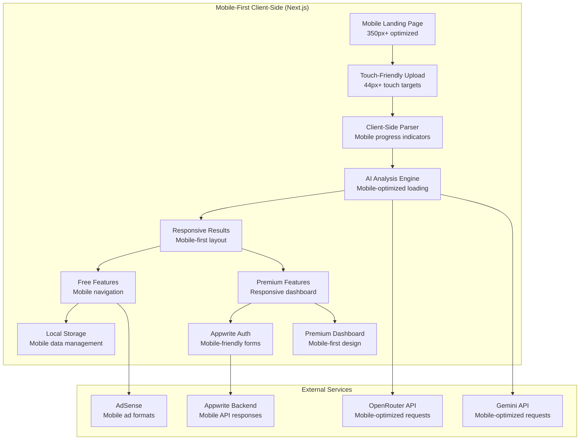
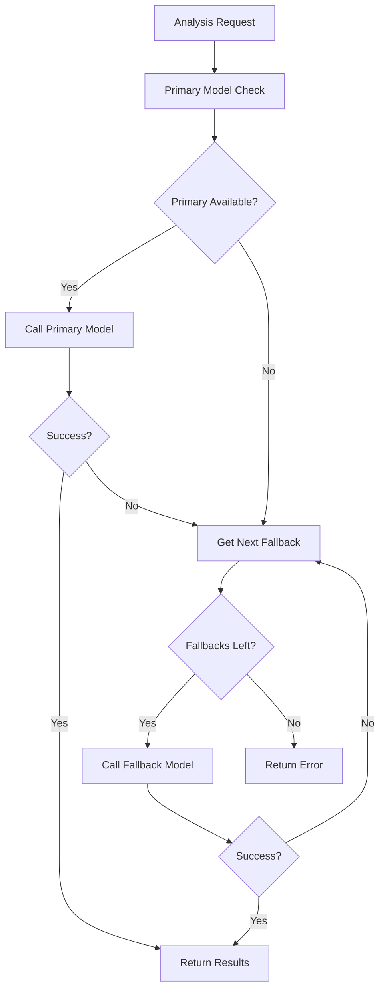
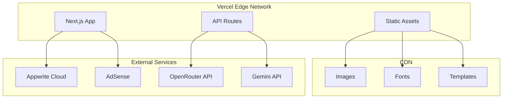

# Design Document

## Overview

The AI-Powered ATS & Resume App is built as a Next.js 15 application with TypeScript and Tailwind CSS following **MOBILE-FIRST DESIGN PRINCIPLES**. The architecture follows a modular, component-based approach with clear separation between free and premium features. The application uses client-side document parsing for privacy, integrates dual AI models (OpenRouter + Gemini), and implements a tiered service model with localStorage for free users and Appwrite for premium authentication.

**CORE DESIGN PRINCIPLE**: All components, layouts, and user interfaces are designed mobile-first, starting with 350px width screens and progressively enhancing for larger devices. This ensures optimal performance and user experience across all device sizes.

## Mobile-First Design Patterns

### Mandatory Mobile-First Approach

**EVERY COMPONENT MUST FOLLOW MOBILE-FIRST DESIGN:**

1. **Base Design**: Start with 350px width screens (very small phones)
2. **Progressive Enhancement**: Add features and styling for larger screens using min-width media queries
3. **Touch-First Interactions**: All interactive elements must be touch-friendly (minimum 44px touch targets)
4. **Content Priority**: Most important content and actions visible on mobile without scrolling
5. **Performance**: Mobile-optimized loading and rendering

### Custom Breakpoint System (MANDATORY)

```css
/* Mobile-First Breakpoints - MUST BE USED IN ALL COMPONENTS */
--breakpoint-xxs: 350px;  /* Very small phones - BASE DESIGN */
--breakpoint-xs: 420px;   /* Small phones */
--breakpoint-sm: 640px;   /* Large phones / small tablets */
--breakpoint-md: 768px;   /* Tablets */
--breakpoint-lg: 1024px;  /* Small laptops */
--breakpoint-xl: 1280px;  /* Laptops */
--breakpoint-2xl: 1536px; /* Large screens */
--breakpoint-3xl: 1920px; /* Extra large screens */
```

### Mobile-First Component Design Rules

#### Layout Components
- **Header**: Collapsible navigation on mobile, full navigation on desktop
- **Sidebar**: Hidden by default on mobile, slide-out drawer, visible on desktop
- **Cards**: Stack vertically on mobile, grid layout on larger screens
- **Forms**: Single column on mobile, multi-column on desktop

#### Interactive Components
- **Buttons**: Minimum 44px height for touch targets
- **Upload Areas**: Smaller on mobile (120px), larger on desktop (160px)
- **Modals**: Full-screen on mobile, centered on desktop
- **Dropdowns**: Native select on mobile, custom dropdown on desktop

#### Content Components
- **Typography**: Smaller base sizes on mobile, larger on desktop
- **Images**: Full-width on mobile, constrained on desktop
- **Tables**: Horizontal scroll on mobile, full table on desktop
- **Charts**: Simplified on mobile, detailed on desktop

### Responsive Design Implementation

```typescript
// MANDATORY: All components must use these patterns

// 1. Mobile-First CSS Classes
<div className="p-4 md:p-6 lg:p-8"> {/* Progressive spacing */}
<h1 className="text-xl md:text-2xl lg:text-3xl"> {/* Progressive typography */}
<div className="grid grid-cols-1 md:grid-cols-2 lg:grid-cols-3"> {/* Progressive layout */}

// 2. Mobile-First Conditional Rendering
{isMobile ? <MobileComponent /> : <DesktopComponent />}

// 3. Mobile-First Hook Usage
const { isMobile, isTablet, isDesktop } = useBreakpoint();
```

## Architecture

### High-Level Mobile-First Architecture



### Technology Stack

- **Frontend Framework**: Next.js 15 with App Router
- **Language**: TypeScript (strict mode, no any types)
- **Styling**: Tailwind CSS v4 with mobile-first design approach
- **Responsive Design**: Mobile-first breakpoints supporting screens from 350px to 1920px+
- **UI Components**: shadcn/ui with Lucide React icons
- **Animations**: Framer Motion
- **State Management**: Zustand for global state, localStorage for free tier
- **Form Handling**: React Hook Form with Zod validation
- **Authentication**: Appwrite with JWT (user) + Admin role-based auth
- **Document Parsing**: pdfjs-dist, mammoth, html-docx-js
- **AI Integration**: OpenRouter API, Gemini API with fallback system
- **Export**: html2pdf.js, docx-template
- **CMS**: Wisp CMS for blog content
- **Admin Backend**: Next.js API routes with admin middleware
- **Database**: Appwrite Database for user data, admin configs, and analytics
- **Monitoring**: Custom analytics dashboard with error tracking

## Mobile-First Implementation Guidelines

### MANDATORY Mobile-First Development Rules

#### 1. Component Development Process
```typescript
// STEP 1: Always start with mobile design (350px base)
const MobileComponent = () => (
  <div className="p-3 text-sm"> {/* Mobile-first base styles */}
    <h2 className="text-lg font-semibold mb-2"> {/* Mobile typography */}
      {title}
    </h2>
    <div className="space-y-2"> {/* Mobile spacing */}
      {content}
    </div>
  </div>
);

// STEP 2: Add progressive enhancement for larger screens
const ResponsiveComponent = () => (
  <div className="p-3 md:p-4 lg:p-6 text-sm md:text-base"> {/* Progressive enhancement */}
    <h2 className="text-lg md:text-xl lg:text-2xl font-semibold mb-2 md:mb-3 lg:mb-4">
      {title}
    </h2>
    <div className="space-y-2 md:space-y-3 lg:space-y-4">
      {content}
    </div>
  </div>
);
```

#### 2. Layout Patterns (MANDATORY)
```typescript
// Mobile-First Grid System
<div className="grid grid-cols-1 sm:grid-cols-2 lg:grid-cols-3 gap-4">
  
// Mobile-First Flexbox
<div className="flex flex-col md:flex-row gap-4">

// Mobile-First Navigation
<nav className="block md:hidden"> {/* Mobile menu */}
<nav className="hidden md:block"> {/* Desktop menu */}

// Mobile-First Modals
<div className="fixed inset-0 md:inset-auto md:top-1/2 md:left-1/2 md:transform md:-translate-x-1/2 md:-translate-y-1/2">
```

#### 3. Touch-First Interactions (MANDATORY)
```typescript
// All interactive elements MUST meet touch target requirements
<button className="min-h-[44px] min-w-[44px] p-3 rounded-lg"> {/* iOS guidelines */}
<input className="h-12 px-4 text-base"> {/* Prevent zoom on iOS */}
<select className="h-12 px-4 text-base"> {/* Consistent touch targets */}
```

#### 4. Performance Optimization (MANDATORY)
```typescript
// Mobile-first image loading
<Image
  src={src}
  alt={alt}
  sizes="(max-width: 640px) 100vw, (max-width: 1024px) 50vw, 33vw"
  priority={isMobile && isAboveFold}
/>

// Mobile-first code splitting
const DesktopFeature = lazy(() => import('./DesktopFeature'));
{!isMobile && <Suspense fallback={<Loading />}><DesktopFeature /></Suspense>}
```

#### 5. Content Strategy (MANDATORY)
- **Mobile**: Show essential content only, progressive disclosure
- **Tablet**: Add secondary content, improved navigation
- **Desktop**: Full feature set, enhanced interactions

### Mobile-First Testing Requirements

#### Device Testing Matrix (MANDATORY)
- **350px**: iPhone SE (1st gen), very small Android phones
- **375px**: iPhone SE (2nd gen), iPhone 12 mini
- **390px**: iPhone 12/13/14 standard
- **414px**: iPhone 12/13/14 Plus/Pro Max
- **768px**: iPad mini, small tablets
- **1024px**: iPad, large tablets, small laptops
- **1280px+**: Desktop screens

#### Performance Targets (MANDATORY)
- **Mobile**: First Contentful Paint < 1.5s
- **Mobile**: Largest Contentful Paint < 2.5s
- **Mobile**: Cumulative Layout Shift < 0.1
- **Mobile**: First Input Delay < 100ms

## Components and Interfaces

### Mobile-First Components Structure

```
├── components/
│   ├── ui/                     # Mobile-first shadcn/ui components
│   ├── layout/
│   │   ├── Header.tsx          # Mobile: hamburger menu, Desktop: full nav
│   │   ├── Footer.tsx          # Mobile: minimal, Desktop: full footer
│   │   ├── Navigation.tsx      # Mobile: drawer, Desktop: horizontal
│   │   └── MobileMenu.tsx      # Mobile-specific navigation
│   ├── upload/
│   │   ├── DocumentUploader.tsx    # Mobile: touch-friendly, Desktop: drag-drop
│   │   ├── JobDescriptionUploader.tsx # Mobile: textarea, Desktop: enhanced
│   │   ├── FilePreview.tsx     # Mobile: compact, Desktop: detailed
│   │   └── MobileUpload.tsx    # Mobile-specific upload component
│   ├── analysis/
│   │   ├── ATSScoreCard.tsx    # Mobile: vertical, Desktop: horizontal
│   │   ├── KeywordMatcher.tsx  # Mobile: stacked, Desktop: side-by-side
│   │   ├── GrammarChecker.tsx  # Mobile: list view, Desktop: detailed view
│   │   ├── RecommendationsList.tsx # Mobile: accordion, Desktop: grid
│   │   └── MobileResults.tsx   # Mobile-optimized results view
│   ├── editor/                 # Mobile-first premium visual editor
│   │   ├── ResumeEditor.tsx    # Mobile: simplified, Desktop: full-featured
│   │   ├── DragDropBlocks.tsx  # Mobile: tap-to-edit, Desktop: drag-drop
│   │   ├── TemplateSelector.tsx # Mobile: carousel, Desktop: grid
│   │   ├── ExportOptions.tsx   # Mobile: bottom sheet, Desktop: modal
│   │   └── MobileEditor.tsx    # Mobile-specific editor interface
│   ├── dashboard/              # Mobile-first premium dashboard
│   │   ├── DashboardHome.tsx   # Mobile: cards stack, Desktop: grid layout
│   │   ├── AnalysisHistory.tsx # Mobile: list view, Desktop: table view
│   │   ├── UserMetrics.tsx     # Mobile: simplified charts, Desktop: detailed
│   │   └── MobileDashboard.tsx # Mobile-specific dashboard layout
│   ├── admin/                  # Mobile-first admin dashboard
│   │   ├── AdminDashboard.tsx  # Mobile: priority metrics, Desktop: full view
│   │   ├── UserManagement.tsx  # Mobile: search + list, Desktop: table + filters
│   │   ├── PaymentOverview.tsx # Mobile: key stats, Desktop: detailed analytics
│   │   ├── AIModelConfig.tsx   # Mobile: simplified config, Desktop: advanced
│   │   ├── SystemMetrics.tsx   # Mobile: essential metrics, Desktop: comprehensive
│   │   ├── AnalyticsCharts.tsx # Mobile: simple charts, Desktop: interactive
│   │   ├── FeatureTracker.tsx  # Mobile: list view, Desktop: kanban board
│   │   └── MobileAdmin.tsx     # Mobile-specific admin interface
│   ├── auth/
│   │   ├── LoginForm.tsx       # Mobile: full-screen, Desktop: modal
│   │   ├── SignupForm.tsx      # Mobile: step-by-step, Desktop: single form
│   │   ├── AdminLogin.tsx      # Mobile: simplified, Desktop: enhanced security
│   │   ├── AuthGuard.tsx       # Mobile-aware route protection
│   │   └── MobileAuth.tsx      # Mobile-specific auth components
│   └── responsive/             # Mobile-first responsive utilities
│       ├── Breakpoint.tsx      # Breakpoint detection component
│       ├── MobileOnly.tsx      # Mobile-only wrapper
│       ├── DesktopOnly.tsx     # Desktop-only wrapper
│       └── ResponsiveGrid.tsx  # Mobile-first grid system
├── lib/
│   ├── parsers/
│   │   ├── pdfParser.ts
│   │   ├── docxParser.ts
│   │   └── textExtractor.ts
│   ├── ai/
│   │   ├── openRouterClient.ts
│   │   ├── geminiClient.ts
│   │   ├── analysisEngine.ts
│   │   ├── modelFallback.ts
│   │   └── aiModelManager.ts
│   ├── auth/
│   │   ├── appwrite.ts
│   │   ├── authUtils.ts
│   │   └── adminAuth.ts
│   ├── admin/
│   │   ├── userManagement.ts
│   │   ├── paymentTracking.ts
│   │   ├── systemAnalytics.ts
│   │   └── configManager.ts
│   ├── storage/
│   │   ├── localStorage.ts
│   │   └── usageTracker.ts
│   └── utils/
│       ├── exportUtils.ts
│       ├── templateUtils.ts
│       ├── validationSchemas.ts
│       └── errorLogger.ts
├── types/
│   ├── resume.ts
│   ├── analysis.ts
│   ├── user.ts
│   ├── admin.ts
│   └── api.ts
└── app/
    ├── page.tsx                # Landing page
    ├── analyze/
    │   └── page.tsx           # Free analysis tool
    ├── dashboard/
    │   └── page.tsx           # Premium dashboard
    ├── editor/
    │   └── page.tsx           # Visual resume editor
    ├── admin/
    │   ├── page.tsx           # Admin dashboard
    │   ├── users/
    │   ├── payments/
    │   ├── ai-models/
    │   ├── analytics/
    │   └── features/
    ├── auth/
    │   ├── login/
    │   ├── signup/
    │   └── admin/
    └── api/
        ├── analyze/
        ├── export/
        ├── auth/
        └── admin/
            ├── users/
            ├── payments/
            ├── ai-config/
            ├── analytics/
            └── features/
```

### Key Interfaces

```typescript
// Core Types
interface ResumeData {
  id: string;
  content: string;
  metadata: {
    fileName: string;
    fileType: 'pdf' | 'docx';
    uploadDate: Date;
    wordCount: number;
  };
  sections: {
    contact: ContactInfo;
    summary: string;
    experience: Experience[];
    education: Education[];
    skills: string[];
    certifications: Certification[];
  };
}

interface ATSAnalysis {
  score: number;
  breakdown: {
    formatting: number;
    keywords: number;
    structure: number;
    length: number;
  };
  recommendations: Recommendation[];
  keywordMatch: KeywordAnalysis;
  grammarIssues: GrammarIssue[];
  modelUsed: string;
  fallbacksUsed: string[];
}

interface JobDescription {
  content: string;
  extractedKeywords: string[];
  requiredSkills: string[];
  experienceLevel: string;
  jobTitle: string;
}

interface UserUsage {
  dailyCount: number;
  lastReset: Date;
  totalAnalyses: number;
  isPremium: boolean;
}

// Admin Types
interface AdminUser {
  id: string;
  email: string;
  role: 'super_admin' | 'admin' | 'moderator';
  permissions: AdminPermission[];
  lastLogin: Date;
}

interface AIModelConfig {
  id: string;
  name: string;
  provider: 'openrouter' | 'gemini' | 'claude' | 'custom';
  apiKey: string;
  endpoint: string;
  tier: 'free' | 'premium';
  priority: number;
  isActive: boolean;
  fallbackModels: string[];
  rateLimits: {
    requestsPerMinute: number;
    requestsPerDay: number;
  };
}

interface SystemMetrics {
  activeUsers: number;
  totalAnalyses: number;
  apiUsage: {
    [modelId: string]: {
      requests: number;
      failures: number;
      avgResponseTime: number;
    };
  };
  errorRate: number;
  revenue: {
    daily: number;
    monthly: number;
    total: number;
  };
}

interface FeatureRequest {
  id: string;
  title: string;
  description: string;
  priority: 'low' | 'medium' | 'high' | 'critical';
  status: 'idea' | 'planned' | 'in_progress' | 'completed' | 'cancelled';
  complexity: 'simple' | 'medium' | 'complex';
  businessValue: number;
  requestedBy: string;
  createdAt: Date;
  estimatedHours: number;
}
```

## Data Models

### Free Tier Data Storage (localStorage)

```typescript
// localStorage Schema
interface LocalStorageData {
  usage: {
    count: number;
    lastReset: string;
    analyses: string[]; // Analysis IDs
  };
  analyses: {
    [id: string]: {
      resumeData: ResumeData;
      analysis: ATSAnalysis;
      jobDescription?: JobDescription;
      timestamp: string;
    };
  };
  preferences: {
    theme: 'light' | 'dark';
    language: string;
  };
}
```

### Premium Tier Data Models (Appwrite)

```typescript
// User Collection
interface User {
  $id: string;
  email: string;
  name: string;
  subscription: {
    plan: 'free' | 'premium';
    status: 'active' | 'cancelled' | 'expired';
    expiresAt: Date;
    paymentHistory: PaymentRecord[];
  };
  preferences: UserPreferences;
  createdAt: Date;
  updatedAt: Date;
}

// Analysis Collection
interface AnalysisRecord {
  $id: string;
  userId: string;
  resumeData: ResumeData;
  analysis: ATSAnalysis;
  jobDescription?: JobDescription;
  createdAt: Date;
}

// Resume Templates Collection
interface ResumeTemplate {
  $id: string;
  name: string;
  category: 'modern' | 'professional' | 'creative';
  structure: TemplateStructure;
  styling: TemplateStyles;
  isActive: boolean;
}

// Admin Collections
interface AdminConfig {
  $id: string;
  key: string;
  value: any;
  category: 'ai_models' | 'system' | 'features' | 'payments';
  updatedBy: string;
  updatedAt: Date;
}

interface PaymentRecord {
  $id: string;
  userId: string;
  amount: number;
  currency: string;
  status: 'pending' | 'completed' | 'failed' | 'refunded';
  paymentMethod: string;
  transactionId: string;
  createdAt: Date;
}

interface SystemLog {
  $id: string;
  level: 'info' | 'warning' | 'error' | 'critical';
  message: string;
  context: any;
  userId?: string;
  adminId?: string;
  createdAt: Date;
}
```

## Error Handling

### Client-Side Error Handling

```typescript
// Error Types
type AppError = 
  | 'PARSE_ERROR'
  | 'AI_API_ERROR'
  | 'USAGE_LIMIT_EXCEEDED'
  | 'AUTH_ERROR'
  | 'EXPORT_ERROR'
  | 'NETWORK_ERROR';

// Error Handler
class ErrorHandler {
  static handle(error: AppError, context?: any) {
    switch (error) {
      case 'PARSE_ERROR':
        return {
          message: 'Unable to parse document. Please ensure it\'s a valid PDF or DOCX file.',
          action: 'Try uploading a different file format',
          recoverable: true
        };
      case 'USAGE_LIMIT_EXCEEDED':
        return {
          message: 'Daily analysis limit reached (5/5)',
          action: 'Upgrade to premium for unlimited analyses',
          recoverable: false
        };
      // ... other error cases
    }
  }
}
```

### API Error Handling

```typescript
// API Response Wrapper
interface APIResponse<T> {
  success: boolean;
  data?: T;
  error?: {
    code: string;
    message: string;
    details?: any;
  };
}

// Retry Logic for AI APIs
class AIAPIClient {
  async callWithRetry(apiCall: () => Promise<any>, maxRetries = 3) {
    for (let i = 0; i < maxRetries; i++) {
      try {
        return await apiCall();
      } catch (error) {
        if (i === maxRetries - 1) throw error;
        await this.delay(Math.pow(2, i) * 1000); // Exponential backoff
      }
    }
  }
}
```

## Testing Strategy

### Unit Testing

```typescript
// Component Testing with React Testing Library
describe('DocumentUploader', () => {
  test('should handle PDF upload successfully', async () => {
    const mockFile = new File(['pdf content'], 'resume.pdf', { type: 'application/pdf' });
    render(<DocumentUploader onUpload={mockOnUpload} />);
    
    const input = screen.getByLabelText(/upload resume/i);
    fireEvent.change(input, { target: { files: [mockFile] } });
    
    await waitFor(() => {
      expect(mockOnUpload).toHaveBeenCalledWith(expect.objectContaining({
        fileName: 'resume.pdf',
        fileType: 'pdf'
      }));
    });
  });
});

// Parser Testing
describe('PDFParser', () => {
  test('should extract text from PDF correctly', async () => {
    const mockPDFBuffer = new ArrayBuffer(1024);
    const result = await pdfParser.parse(mockPDFBuffer);
    
    expect(result).toHaveProperty('content');
    expect(result).toHaveProperty('metadata');
    expect(result.metadata.wordCount).toBeGreaterThan(0);
  });
});
```

### Integration Testing

```typescript
// AI Analysis Integration Tests
describe('AI Analysis Flow', () => {
  test('should complete full analysis pipeline', async () => {
    const mockResume = createMockResumeData();
    const mockJD = createMockJobDescription();
    
    const analysis = await analysisEngine.analyze(mockResume, mockJD);
    
    expect(analysis.score).toBeGreaterThanOrEqual(0);
    expect(analysis.score).toBeLessThanOrEqual(100);
    expect(analysis.recommendations).toHaveLength.greaterThan(0);
    expect(analysis.keywordMatch).toHaveProperty('missing');
    expect(analysis.keywordMatch).toHaveProperty('found');
  });
});
```

### E2E Testing

```typescript
// Playwright E2E Tests
test('Free user can analyze resume', async ({ page }) => {
  await page.goto('/analyze');
  
  // Upload resume
  await page.setInputFiles('[data-testid="resume-upload"]', 'test-resume.pdf');
  
  // Upload job description
  await page.fill('[data-testid="job-description"]', 'Software Engineer job posting...');
  
  // Start analysis
  await page.click('[data-testid="analyze-button"]');
  
  // Verify results
  await expect(page.locator('[data-testid="ats-score"]')).toBeVisible();
  await expect(page.locator('[data-testid="recommendations"]')).toBeVisible();
  await expect(page.locator('[data-testid="keyword-match"]')).toBeVisible();
});
```

### Performance Testing

```typescript
// Performance Benchmarks
describe('Performance Tests', () => {
  test('PDF parsing should complete within 5 seconds', async () => {
    const startTime = performance.now();
    const largePDF = createLargePDFBuffer(5 * 1024 * 1024); // 5MB
    
    await pdfParser.parse(largePDF);
    
    const endTime = performance.now();
    expect(endTime - startTime).toBeLessThan(5000);
  });
  
  test('AI analysis should complete within 30 seconds', async () => {
    const startTime = performance.now();
    const mockData = createMockResumeData();
    
    await analysisEngine.analyze(mockData);
    
    const endTime = performance.now();
    expect(endTime - startTime).toBeLessThan(30000);
  });
});
```

## AI Model Fallback System

### Fallback Architecture



### Model Management System

```typescript
class AIModelManager {
  private models: Map<string, AIModelConfig> = new Map();
  private fallbackChains: Map<string, string[]> = new Map();
  
  async analyzeWithFallback(
    content: string, 
    tier: 'free' | 'premium'
  ): Promise<ATSAnalysis> {
    const primaryModel = this.getPrimaryModel(tier);
    const fallbacks = this.getFallbackChain(tier);
    
    for (const modelId of [primaryModel, ...fallbacks]) {
      try {
        const result = await this.callModel(modelId, content);
        return {
          ...result,
          modelUsed: modelId,
          fallbacksUsed: fallbacks.slice(0, fallbacks.indexOf(modelId))
        };
      } catch (error) {
        this.logModelFailure(modelId, error);
        continue;
      }
    }
    
    throw new Error('All AI models failed');
  }
  
  updateModelConfig(config: AIModelConfig): void {
    this.models.set(config.id, config);
    this.rebuildFallbackChains();
  }
}
```

### Admin Model Configuration Interface

```typescript
interface ModelConfigUpdate {
  modelId: string;
  changes: Partial<AIModelConfig>;
  adminId: string;
  reason: string;
}

interface FallbackChainConfig {
  tier: 'free' | 'premium';
  primaryModel: string;
  fallbackModels: string[];
  maxRetries: number;
  timeoutMs: number;
}
```

## Security Considerations

### Client-Side Security

- **Document Processing**: All document parsing happens client-side to ensure privacy
- **Data Sanitization**: All user inputs are sanitized before processing
- **XSS Prevention**: Use React's built-in XSS protection and validate all dynamic content
- **CSRF Protection**: Implement CSRF tokens for state-changing operations

### API Security

- **Rate Limiting**: Implement rate limiting for AI API calls
- **Input Validation**: Validate all API inputs using Zod schemas
- **Authentication**: Use JWT tokens with proper expiration
- **CORS**: Configure CORS properly for production

### Data Privacy

- **Free Tier**: No data stored on servers, everything in localStorage
- **Premium Tier**: Encrypted data storage in Appwrite
- **GDPR Compliance**: Implement data deletion and export features
- **Analytics**: Use privacy-focused analytics (no PII tracking)

## Deployment Architecture

### Production Setup



### Environment Configuration

```typescript
// Environment Variables
interface EnvironmentConfig {
  NEXT_PUBLIC_APPWRITE_ENDPOINT: string;
  NEXT_PUBLIC_APPWRITE_PROJECT_ID: string;
  OPENROUTER_API_KEY: string;
  GEMINI_API_KEY: string;
  NEXT_PUBLIC_ADSENSE_CLIENT_ID: string;
  WISP_CMS_API_KEY: string;
  NODE_ENV: 'development' | 'production';
}
```

This design provides a solid foundation for building the AI-Powered ATS & Resume App with clear separation of concerns, robust error handling, comprehensive testing, and scalable architecture.